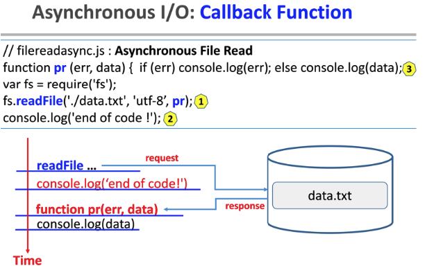
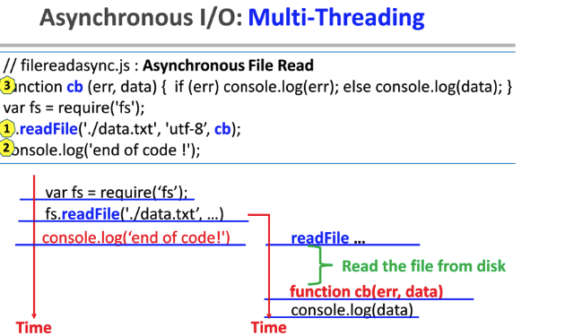
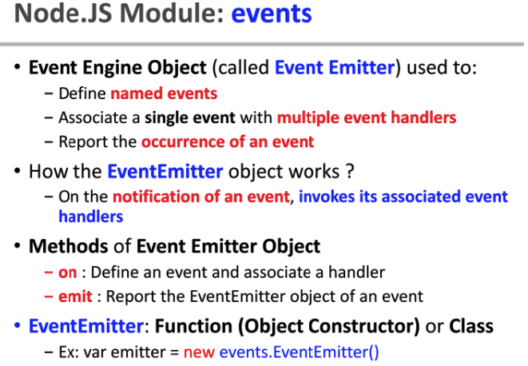
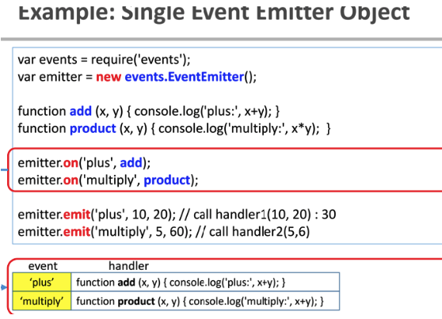
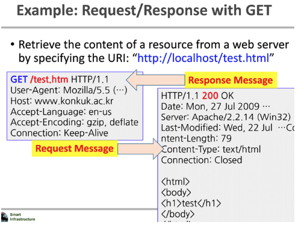
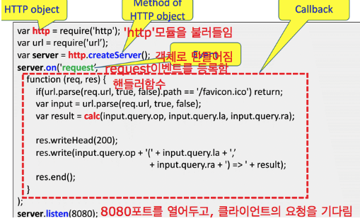
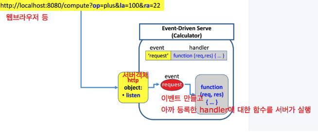

181121 Wednesday 
===================

- image ref : https://air.cs.kookmin.ac.kr/
- Callback Function
- Event
- HTTP / MQTT Modules
----------


 


Callback
-------------------

- 콜백함수 : 서비스가 다른 서비스를 호출->결과를 처리하는데 사용되는것




(1) readFile : 외부시스템에게 요청하고 다음 작업으로 넘어간다. 
(2) response를 기다리지않는다. 
(3) 그리고 나중에 function pr이 실행된다. 




(1). node.js는 블로킹되어 기다리지 않는다. 
(2). 다른 시스템에게 넘겨버린다. 
(3). 후속작업을 콜백함수로 만들어서 넘긴다. 
(4). 이를 이벤트 관점으로 보면, 파일시스템에 요청을 넣는다.(readFile) 
(5). ‘data.txt’를 가지고, function cb를 부른다. 이게 별도의 스레드처럼 작동한다. 


Event
-------------
다음 3가지를 이벤트로 본다. 

1. notification / alert as event
2. service request as event
3. Service response as event


- 이벤트를 통해 콜백까지 수행한다 : 직접 서비스를 부르는게 아니라, 이벤트로 본다. 그래서 이벤트를 통해서 서비스를 다룬다. 그리고 서비스에 대한 응답을 한다.


- 서비스와 무관하게, 사건이 발생했을때(ex:센싱) notify

- 이벤트에 관한 node.js modules(node.js로 짜여진 javascript코드고, 불러들일땐 모듈) : 코딩의 기본구조는, 하려는 일이 모듈로 구성되어있는데 이것을 불러와 쓴다. 


 

 
 
 
(1) ‘event’의 모듈을 require로 불러온다. 
(2) emitter의 함수 on과 emit이 있다. 
(3) on의 인자로 event와 그에 해당하는 핸들러handler를 주고, emit의 인자인 event ‘plus’가 들어가면 plus에 해당하는 핸들러인 add가 실행되고, 10,20이 add의 인자로 들어간다. 


Protocol : MQTT / HTTP
-------------

1.  HTTP 프로토콜

클라이언트가 서버에게 request할때 또는 서버로부터 response를 받을 때 메소드는 GET,POST 등이 있다. 

 
(1) 웹브라우저에 uri를 치면 왼쪽과 같은 형식으로 서버에 간다.
(2) 서버는 이렇게 주소로 날라오면 다음과 같이 처리한다. 

 
 
 
 
  

2. HTTP 코드

```
var http = require('http'); //http모듈을 불러들어옴
var url = require('url');


function calc (op, la, ra) {
    var l = Number(la);
    var r = Number(ra);
    if(op == 'plus') return l+r;
    else if(op == 'minus') return l-r;
    else if(op == 'multiply') return l*r;
    else if(op == 'divide') return l/r;
    else return 0;
}

var server = http.createServer(); //서버 객체 생성 

/*
server.on('request', function (req, res){}); 함수 설명
클라이언트가 요청하는 내용인 Data들은 request에 담긴다.

콜백함수 function(req,res)의 인자는 : 클라에서 서버로 보낼때 http프로토콜을 통해서 간다. 이때 req,res가 쓰임.

on메소드로 request이벤트에 대한 핸들러 function(req,res)를 등록한다. (클라에서 요청이 들어오면 서버에서 핸들러에 대한 콜백함수가 동작한다.
*/

server.on('request', function (req, res) { 
    if(url.parse(req.url, true, false).path == '/favicon.ico') return;

    console.log('\n\n *** REQUEST ***');
    console.log('METHOD:', req.method);
    console.log('URL:', url.parse(req.url, true, false).path);
    console.log('HEADERS:', req.headers);

    var input = url.parse(req.url, true, false); //데이터를 가져오는 메소드
    var result = calc(input.query.op, input.query.la, input.query.ra);
    /*
	json형태로 저장된 input.query.op
	input={
		quere={
			op="+"
		}
	}
    */

    //응답 메시지도 http 모듈로 쉽게 작성가능하다.
    res.writeHead(200); //200 : 에러없이 success
    res.write(input.query.op + '(' + input.query.la + ',' + input.query.ra + ') => ' + result);
    res.end(); //응답메시지가 완성됐다. 끝났다.
});
server.listen(8080);
```


3. MQTT 코드

```
const mqtt_module = require('mqtt');
const readlineSync = require('readline-sync');
const ip = require("ip");

var ip_addr = ip.address();
var email = readlineSync.question('email (only id, not @ + domain name): ');

var mqtt = {
    url: "mqtt://52.78.203.234",
    client: null,
    connected: false
};
mqtt.client = mqtt_module.connect(mqtt.url);

mqtt.client.on('connect', function () {
    mqtt.connected = true;
    console.log('Now, we are talking to the mqtt server !');

    // email id is the topic for worker
    mqtt.client.subscribe(email);

    setInterval(function () {
        console.log('\n\n--------- to server ---------')
        var contents = readlineSync.question('message: ');
        if(contents != '') {
            var msg = { "email" : email, "ip" : ip_addr, "contents" : contents };
            // 'karpjoo' is the topic for master
            mqtt.client.publish('karpjoo', JSON.stringify(msg));
        }
    }, 5000);
});

mqtt.client.on('message', function (topic, message) {
    var msg = message.toString();
    console.log('\n\n--------- from server ---------')
    console.log(msg);
});
```
