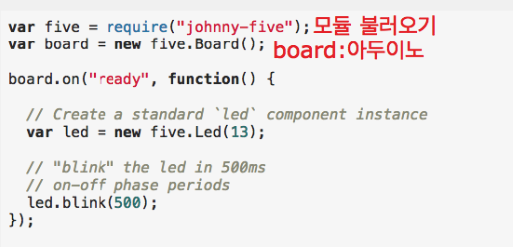
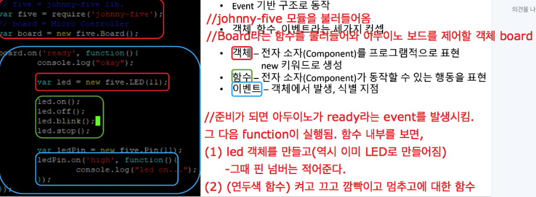
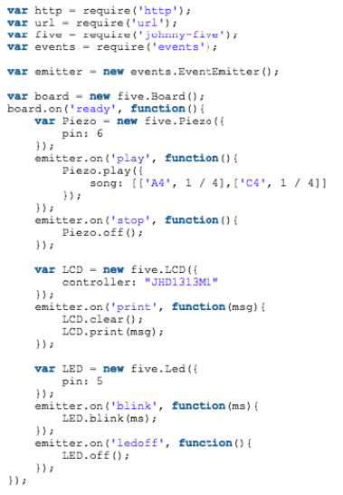

181121 Wednesday 
===================

- Grove Starter Kit에 있는 device들을 Raspberry Pi와 Arduino 상에서 다루는 실습
- Johnny five (Node.js-Based  Open  Source  IoT/Robotics  Programming  Framework)
- Node.js의 Event Driven 코딩 

----------

 

johnny five
-------------------

1. 구글링 : johnny five javascript 

2. johnny five : Node.js-Based  Open  Source  IoT/Robotics  Programming  Framework

3. https://gitter.im/rwaldron/johnny-five : 커뮤니티, 질문

4. http://johnny-five.io/api/

Preparing for Examples
-------------------

1. 준비 : 제어하는 컴퓨터나 라즈베리 파이, 펌웨어 설치할 아두이노

2. 아두이노 펌웨어 설치 : https://www.arduino.cc/

3. 아두이노와 컴퓨터를 연결하고 Arduino IDE띄우기
  (1) 파일-예제-Firmata-StandardFirmata
  (2) 툴-포트-arduino 포트 선택
  (3) 업로드 버튼
  (4) 여기까지 했으면 펌웨어가 올라간 것이다. => 아두이노가 johnny five에 종속된다. (johnny five가 아두이노를 통제)

4. 이제 아두이노와 라즈베리를 연결해야한다. 그전에 라즈베리 파이에는 os가 깔려있음을 전제로 한다. 

Code Examples with 'johnny-five'
-------------------

1. johnny-five 프로그램 동작 원리 

2. 예제 : connect board

3. 예제

 (1) url을 웹브라우저 등 클라이언트에서 입력하면, 서버 측에서는 reqeust에 대해 파싱한다. 
 (2) url에 if조건문에 해당하는것을 실행한다. (스피커면 id가 ‘piezo’인 경우다.)
 (3) emitter은 node.js 에서 이벤트를 등록하고 발생하는 것이다. 
 (4) 여기에 play가 있는 것이 오면 위에서 정의한 이벤트에 해당하는 핸들러 함수가 동작한다. 
 (5) 라파이의 주소
      http 서버 객체
      id=piezo //스피커
      cmd=play //커맨드는 플레이

	=> 모든 디바이스들이 초연결됨

4. node.js의 event driven 코딩은 코드를 나열하면 되고, event로 묶인다. 
 
