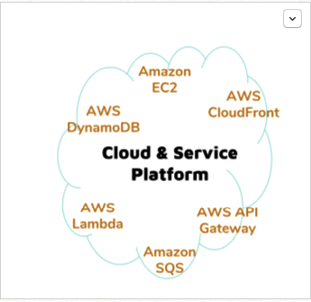

181128 Wednesday 
===================

- Amazon AWS IoT
- Usage Plans
- Communication between Things and Platform(AWS IoT)
- Made a new channel 
----------

 

Available Usages
-------------------

1. 아두이노 업로드 : 노트북에서 업로드해서 이진파일을 아두이노에서 실행한 것

2. 센서로 수집한 데이터를 지도서버로 전달

3. 데이터 품질 관리 : 센서값이 제대로 전달되게 하기 위해 센서 관리

4. 지도에 표시되는 데이터를 가공할 수 있다. (그래프 만들기, 센서 사양 정보 보여주기, 풍선모양으로 나타내기 등)

5. IOT 서비스로 Hub 구축 - aws (학과에서 지원)

    기기를 aws에 등록해서 hub를 통해 지도에 나타난다.

    이때 보안이 필요하고, 사용자의 기기가 로그인 할 수 있게 공인인증서 개념의 인증서로 인증해서 데이터 신뢰성 확보가 필요하고, 아두이노는 저사양이므로 인증서를 저장하고 사용하는 것이 불가능하므로 하드웨어에 라즈베리파이를 넣어서 인증서 저장과 컴파일을 가능하게 한다. 라파이 대신 이 기능을 대신하게 aws에서 가상화해서 리눅스 서버 등을 사용할수있지만 lambda 서비스로 인증을 구현해놨다.

    라파이가 있으면 와이파이를 핀을 꼽는 등 하면 되는데, aws에 이걸 올려놓았으므로 후에 진행한다. 

    아두이노 이지만 확장된 하드웨어를 아두이노+aws상의 람다서비스 로 본다.
    (와이파이는 장소바뀔 때 마다 각각 다른 것을 사용한다. )

6. 람다서비스를 제거하는 방법은 라파이로 대신한다. 그러면 라파이가 와이파이를 쏜다. 
    인증서도 라이브러리에 넣어서 한 라이브러리로 만들어버린다. 
    
    cf) 라이브러리 링킹 : 에디터에서 소스코드를 합치는 것

    내 IoT Hub를 aws로 만들어서 이 장비를 이 안에 등록하는것이다. 
    여러명의 센서를 수집하고, 활성화시켜서 활용할 수 있다. 단, 이 데이터를 지도 서버에 주기도 해야한다. 

사물과 플랫폼(aws iot)간의 통신
-------------------
1. 통신이 이루어지지 않을 때, 고의 또는 실수로 => 사물 통신에 대한 보안(인증서) 
2. 노드(사물)는 플랫폼에 들어가서 다른 사물을 지워버릴 수 있다. 이를 막기 위해 정책으로 관리한다. 정책이란, 쉽게 말하면 사물이 플랫폼에서 할 수 있는걸 코딩한 것을 의미한다. 

    데이터 주고받기위해 사물을 연결해야한다. 물리적인 사물이 있고, 플랫폼 상에 등록된 사물정보가 있다. 물리적인의 미세먼지 농도, 온도, 습도를 플랫폼에 등록하면 ‘상태갱신’(update)이라고 한다. 

    만약 연결이 끊어지면 (산속에 미세먼지 센서가 있을때 등) 앞으로 상태 정보는 어떻게 가져와야할까? 

3. ‘사물 섀도우’개념
    플랫폼에 올라가있는건 물리적인 사물을 반영하고 있는 사물 섀도우 -> reported된 상태 / 원하는 상태(desired)

    제보하고 나서 바꾸길 원하는 경우처럼 일시적으로 불일치된 경우는, aws iot가 일시적 불일치(delta)를 알려준다. 우리는 그 바뀐만큼 바꾸면 된다. 

    사물 섀도우로 할수있는것? 업데이트 / 문서 업데이트 / 가져오기 / 삭제

    사물은 사물 스스로 상태를 변경할 수 있다. 만약 상태가 변하도록 요구되어지면 'desired'라고 한다. 

    ex) iot 연결 후에 상태 가져온다. 이중 desired값이 있으면 거기에 맞춰지도록 노력해야한다. 
        사물 섀도우를 제어하면(요구하면) 물리적인 사물이 이렇게 되도록 한다. 

    ex)에어컨은 10도로 맞추면, 에어컨이 그렇게 동작한다. 근데 온도계같은 경우는 불가능하다(사물이 요청을 거부할수있다.)

4. 예전 값을 저장해야하는데, 아두이노에는 불가능하다. AWS Cloud로 대신하자. 
    Job : 사물이 계산을 요청하면, 실행이 클라우드에서 된다. 함수호출처럼 계산 결과값을 요청한것이다. 
 

 

Making a new channel
-------------------

[thingspeak.com](thingspeak.com)

